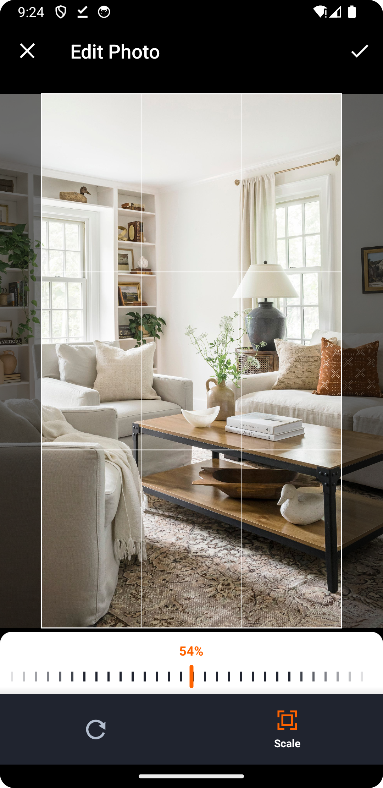
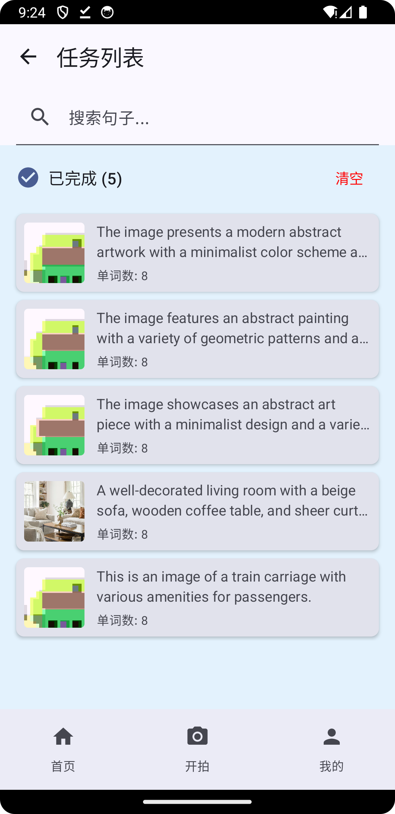

# PictureTalk

说明：本项目为PictureTalk的 Android版本，功能同[iOS版本](https://github.com/nowszhao/PictureTalk)

PictureTalk(图语) 是一款创新的英语学习iOS应用，通过丰富多样的图片场景帮助用户轻松掌握英语词汇、短语和表达。无论是家庭、学校、办公室还是旅游场景，图景英语都能为您提供生动的学习体验.

_一款基于场景的英语单词学习应用。_

## 为什么选择 PictureTalk?

传统的单词记忆方式往往枯燥乏味。PictureTalk 通过场景化学习的方式,让你在真实的生活场景中学习英语单词,让单词记忆更加生动有趣且高效。

## 不止于单词记忆
从最初的场景单词标注,到现在的智能单词分析、学习计划制定、进度追踪等功能,PictureTalk 正在成为一个全方位的英语学习助手。

## 主要功能

1. **场景化学习**
    - 拍照或从相册选择图片创建学习场景
    - AI 智能识别场景中的单词并标注位置
    - 生成场景相关的英语句子

2. **智能分析**
    - 根据用户英语水平推荐合适的单词
    - 提供单词音标、释义等详细信息
    - 支持单词发音

3. **学习管理**
    - 自定义每日学习计划
    - 追踪学习进度和成果
    - 支持单词收藏和复习

4. **多样化功能**
    - 场景分享
    - 单词搜索
    - 学习数据统计
    - 自定义学习设置

## 产品截图

  
  
  
  
  

## 开始使用

### 系统要求
- iOS 15.0 或更高版本
- iPhone 或 iPad 设备

### 安装方式

1. 当前仅支持源码自行编译
2. 在github下载apk进行安装

