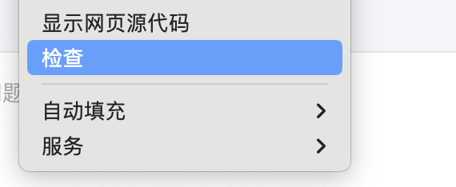
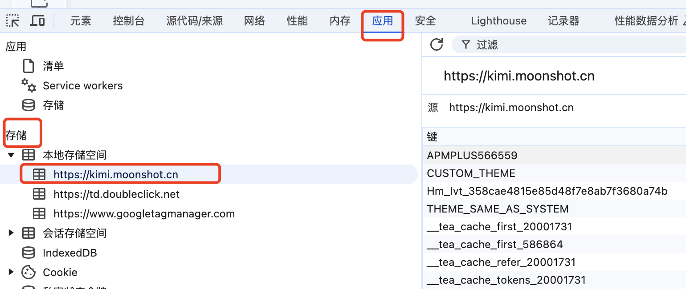
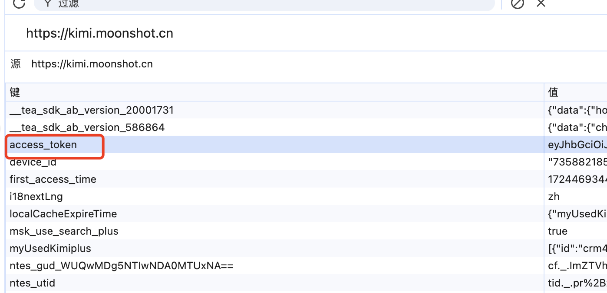

# PictureTalk

说明：本项目为 PictureTalk 的 Android 版本，[iOS版本](https://github.com/nowszhao/PictureTalk)

PictureTalk(图语) 是一款创新的英语学习应用，通过丰富多样的图片场景帮助用户轻松掌握英语词汇、短语和表达。无论是家庭、学校、办公室还是旅游场景，图景英语都能为您提供生动的学习体验。

_一款基于场景的英语单词学习应用。_

## 为什么选择 PictureTalk?

传统的单词记忆方式往往枯燥乏味。PictureTalk 通过场景化学习的方式，让你在真实的生活场景中学习英语单词，让单词记忆更加生动有趣且高效。

## 主要功能

1. **场景化学习**
    - 拍照或从相册选择图片创建学习场景
    - AI 智能识别场景中的单词并标注位置
    - 生成场景相关的英语句子和中文翻译

2. **智能分析**
    - 根据用户英语水平（初级/中级/高级）推荐合适的单词
    - 提供单词音标、释义等详细信息
    - 支持单词发音和自动播放功能

3. **学习管理**
    - 任务列表管理和搜索
    - 支持单词卡片位置自定义调整
    - 支持场景分享功能

4. **多样化功能**
    - 支持图片裁剪和编辑
    - 支持学习场景分享
    - 支持 KIMI AI 配置
    - 支持深色/浅色主题

## 系统要求
- Android 7.0 (API 24) 或更高版本
- 摄像头（用于拍照功能）
- 网络连接

## 安装方式

1. 从 [GitHub Releases](https://github.com/nowszhao/PictureTalk4Android/releases/latest) 下载最新版本的 APK 安装包
2. 允许安装来自未知来源的应用
3. 安装完成后即可使用
4. 配置KIMI AI 的 Token,参考下图：
   1. 使用 chrome浏览器登录KIMI网页版 https://kimi.moonshot.cn/
   2. 鼠标右键点击"检查"
    
   3. 在弹出的窗口中，依次点击"应用"->"存储"->"本地存储空间"->"https://kimi.moonshot.cn"
    
   4. 在右侧的"值"中找到"access_token"，复制其值
    

## 权限说明

应用需要以下权限才能正常运行：
- 相机权限：用于拍照功能
- 存储权限：用于保存和访问图片
- 网络权限：用于 AI 分析和在线功能

## 开源协议

本项目基于 MIT 协议开源，详见 [LICENSE](LICENSE) 文件。

